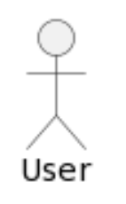
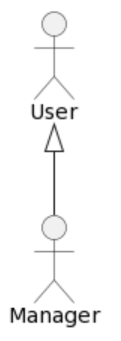
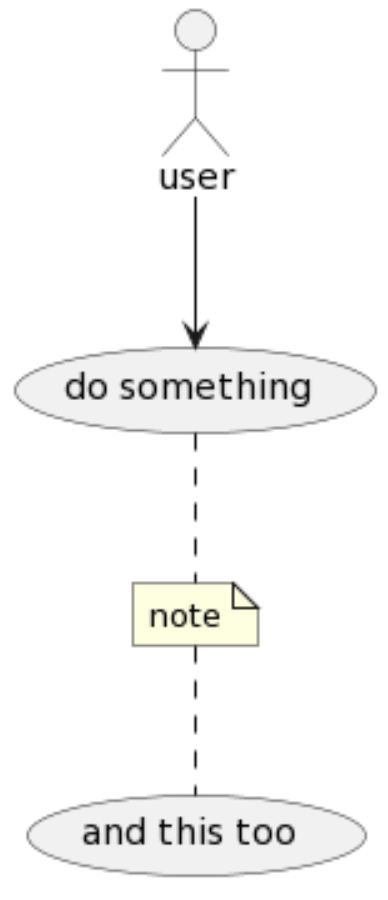
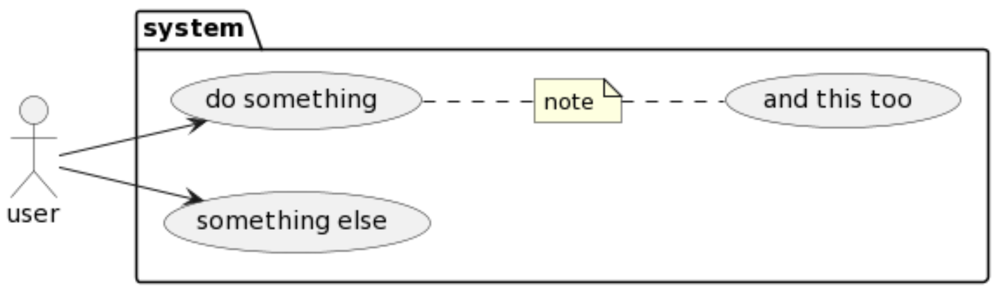

# Overview

In this activity, you will be given a somewhat vague description of user requirements. From this description, your task is to identify user goals and interactions and represent them by drawing a use case diagram.

# Thyago's PlantUML Cheat Sheet 

```
:User:
```



```
:User:
:Manager:
User  <|-- Manager
```



```
:user: --> (do something)
```


```
:user: --> (do something)
(do something) .. (and this too) : label 
```


```
:user: --> (do something)
note "note" as n1
(do something) .. n1
n1 .. (and this too) 
```



```
left to right direction

package system {
note "note" as n1
(do something) .. n1
n1 .. (and this too)  
(something else)
}

:user: --> (do something)
:user: --> (something else)
```




# Scenario 1

A computerized system is to be developed for recording sales and handling payments in a typical retail store. The system will interact with hardware components such as bar code scanners and computers. Its goals include:

* Increasing checkout automation
* Enabling fast and accurate sales analysis
* Supporting automatic inventory control

The primary actors to consider in the use case diagram are:

* Customer
* Cashier
* Manager

# Scenario 2

A system is to be developed that allows users to register for workshops. During a workshop, participants must check in daily. If a participant attends at least 50% of the workshop days, they receive a certificate, which they can share on social media platforms.

On the last day of the workshop, participants are invited to complete an evaluation form.

Administrator users are responsible for:

* Creating workshops, including defining their daily schedules
* Issuing evaluation reports at any time
